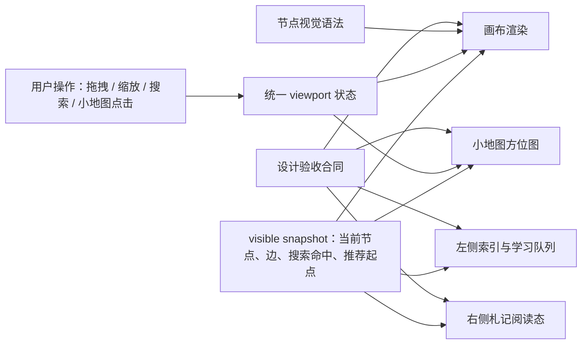

# refactor: 东方山水图谱可用性与设计语法升级

## Overview

这份计划是 `docs/plans/2026-04-27-001-refactor-oriental-atlas-parity-plan.md` 的后续。上一轮已经把生成页对齐到“东方编辑部 × 数字山水”视觉原型，本轮不改视觉身份，不重新做方向探索，而是补齐图谱作为开源工具的可用性与设计执行规则。

当前问题集中在四类：画布不可拖拽缩放、小地图没有定位作用、左侧学习队列长标题撑破布局、右侧札记栏阅读长内容时出现横向滚动。BP 设计审查进一步指出：计划需要补上节点视觉语法、小地图视觉语法、阅读态布局、学习队列条目样式、首次打开画面和设计验收标准，否则实现可能功能正确但气质下降。

---

## Problem Frame

东方山水图谱已经是 llm-wiki 的视觉资产，不是待推翻的草稿。用户明确要求不改变这个视觉方向，而是把它从“漂亮页面”推进成“开源用户真的能用的图谱工具”。

llm-wiki 已经有 1.2K GitHub stars，图谱页面需要同时服务两类人：

- 第一次打开的开源用户：10 秒内理解这是成熟知识产品，知道从哪里开始看。
- 长期使用的知识库用户：能拖动画布、缩放、定位、阅读长内容、管理学习队列，不被横向滚动和大卡片阻断。

本轮计划的核心设计判断：画布负责空间和关系，右侧负责解释和正文，左侧负责入口和学习队列。不要让一个区域承担所有任务。

---

## Requirements Trace

- R1. 保留“东方编辑部 × 数字山水”视觉身份，不改成普通工程 dashboard，也不重新做视觉方向探索。
- R2. 中央画布支持拖拽、滚轮或触控板缩放、回到全图，并保持地图式空间感。
- R3. 小地图从装饰性缩略图升级为“方位图 / 局部索引图”，能定位主画布，并保持东方地图册气质。
- R4. 节点卡片改为分层视觉语法：普通节点像地名，重要节点像索引签条，选中节点像朱砂批注。
- R5. 节点多时不能满屏完整卡片；默认信息要轻，完整内容进入右侧札记栏。
- R6. 左侧学习队列改为竖向“书签条 / 札记条”，长标题不横向滚动。
- R7. 右侧札记栏支持“阅读态”：选中节点后适度扩展阅读空间，但不让画布失去主角地位。
- R8. 首次打开时必须有明确画面：全局图保持中立，推荐起点以预览和弱高亮出现，右侧显示“从这里开始”预览；用户点击后才进入选中节点和阅读态。
- R9. 左侧、右侧、正文、来源路径、wikilink 和代码块不能造成整页横向滚动。
- R10. 13 寸、平板和移动端都必须有清楚降级；移动端仍能搜索、点节点、读详情。
- R11. 设计验收不仅检查功能可用，还检查东方山水视觉语法是否保住。

---

## Scope Boundaries

- 不重做东方山水视觉方向。
- 不新增第二套图谱主题。
- 不把右侧札记栏改成独立文档阅读器；它仍然服务当前选中节点。
- 不要求本轮新增 graph-data 字段；优先从现有节点、边、社区、权重、内容和推荐起点派生。
- 不把小地图做成复杂独立导航系统；它只负责主画布定位和当前视口反馈。
- 不在计划阶段决定最终像素值；本计划定义设计语法、交互形态、文件边界和验收标准。
- 落地拆成两段，但不缩最终目标：
  - 第一段先交付可用性主线：画布拖拽缩放、小地图点击定位、学习队列和右侧阅读不横向溢出，并补齐对应测试。
  - 第二段补齐设计语法主线：节点分层视觉、首屏软引导、东方设计合同、浏览器截图验收和文档更新。

---

## Context & Research

### Relevant Code and Patterns

- `docs/design/oriental-atlas/DESIGN.md`：当前视觉系统，已定义东方编辑部、数字山水、文献索引、批注札记、节点、边、响应式和动效方向。
- `docs/design/oriental-atlas/design-brief.md`：明确目标是成熟知识产品，不是 demo；要求左侧导航、中间画布、右侧详情和二级信息都保持清楚。
- `docs/design/oriental-atlas/oriental-editorial-atlas.html`：已批准的视觉和布局原型。
- `docs/plans/2026-04-27-001-refactor-oriental-atlas-parity-plan.md`：上一轮完成的原型对齐计划，本轮作为上下文，不再往 completed 计划里追加新工作。
- `templates/graph-styles/wash/header.html`：东方图谱 HTML 骨架和 CSS 主体。
- `templates/graph-styles/wash/graph-wash.js`：当前图谱运行时、节点渲染、小地图渲染、学习队列、右侧详情和交互入口。
- `templates/graph-styles/wash/graph-wash-helpers.js`：图谱数据规范化、可见状态、学习队列和密度预算 helper。
- `tests/graph-html-minimap.regression-1.sh`：当前只覆盖小地图存在和基础渲染，需要升级到定位行为合同。
- `tests/graph-html-long-label.regression-1.sh`：当前覆盖节点长标签，需要扩展到学习队列、右侧标题、来源路径和 wikilink。
- `tests/graph-html-density.regression-1.sh`：已有密度预算基础，需要加入节点视觉语法的验收。
- `tests/js/graph-wash-runtime-state.test.js`：适合承接 viewport、小地图和可见状态联动的纯逻辑测试。

### Institutional Learnings

- `docs/solutions/developer-experience/graph-style-simplification-to-wash-only-2026-04-20.md`：图谱必须视觉可读才算达标，自动化测试通过不等于用户可接受。
- `docs/solutions/ui-bugs/graph-wash-null-safety-and-label-truncation-fix-2026-04-21.md`：标签尺寸规则要集中，图谱测试不能只做静态 grep。

### External References

- React Flow viewport concept: https://reactflow.dev/learn/concepts/the-viewport
- React Flow MiniMap component: https://reactflow.dev/api-reference/components/minimap
- Sigma.js node data and label controls: https://www.sigmajs.org/docs/advanced/data/
- Cytoscape.js pan and zoom viewport model: https://js.cytoscape.org/
- Tom Sawyer graph visualization guidance on visual clutter: https://blog.tomsawyer.com/node-graph-visualization

外部结论：成熟图谱工具普遍把画布视口作为核心状态，小地图服务定位，节点标签按重要性和交互状态显示。完整信息不应长期堆在画布节点上。

---

## Key Technical Decisions

- **设计身份不变，组件形态可优化。** “不改视觉”指不改变东方山水身份，但允许节点、学习队列、右侧栏、小地图在同一视觉系统下重做得更好用。
- **统一 viewport 状态。** 画布拖拽、缩放、回到全图、搜索居中、小地图定位都更新同一份视口状态。
- **坐标规则显式化。** 节点、连线、小地图和视口框都从同一套 atlas 坐标换算出来，避免节点、边和小地图各自计算位置。
- **拖拽缩放只移动画布层。** 拖拽和缩放不能重建全部节点、连线、右侧栏和学习队列；搜索、筛选、切社区、选节点才触发完整渲染。
- **小地图是方位图，不是第二张图谱。** 它的视觉职责是定位和反馈当前视口，不能抢中央画布叙事。
- **节点默认降噪。** 普通节点只负责定位和识别，重要节点和选中节点才承担更多视觉重量。
- **右侧阅读态是状态，不是固定挤压。** 选中节点后右侧进入阅读态，适度扩展；回到全图或关闭阅读时，画布重新成为主角。
- **长内容使用纵向阅读，不用横向滚动兜底。** 只有代码块可以内部横向滚，整页和右侧栏不能横向滚。
- **首次打开使用软引导。** 首屏保持全局图，推荐起点只做预览和弱高亮；用户点击推荐起点后，才进入选中态、邻域高亮和阅读态。

---

## Open Questions

### Resolved During Planning

- 是否推翻东方山水视觉方向？不推翻。
- 是否只做最小 bug fix？不只做最小修复，要补上节点密度和设计语法。
- 是否让右侧永久大幅侵占画布？不永久侵占，只在阅读态适度扩展。
- 是否让所有节点都保持完整卡片？不保持，节点按状态和密度分层。
- 是否一次性全做？不一次性全做，落地拆成两段：第一段先修核心可用性，第二段补齐设计语法和完整验收。
- 首次打开是否自动选中推荐起点？不自动选中。首屏保持全局视图，只做推荐起点预览，用户点击后再进入选中阅读。
- 是否第一版就做完整可见区域裁剪？不做完整裁剪，但 U2 必须把坐标规则和视口边界留好，后续可以升级到只渲染当前视口附近节点。

### Deferred to Implementation

- 阅读态展开宽度的最终数值：实现时通过 1440、13 寸、平板视口截图确认。
- 小地图第一版是否支持拖动视口框：计划建议先实现点击定位，但 viewport 状态要为拖动留出空间。
- 节点具体 CSS 类名：实现时按现有 `header.html` 和 `graph-wash.js` 命名收敛。
- 大图谱完整视口裁剪：本轮只要求拖拽缩放不全量重绘，并保留 `model bounds -> viewport rect -> visible predicate` 的 helper 边界；如果真实用户图谱进入 1000+ 节点，再升级为完整可见区域裁剪。

---

## High-Level Technical Design

> *This illustrates the intended approach and is directional guidance for review, not implementation specification. The implementing agent should treat it as context, not code to reproduce.*



### Design Syntax Matrix

| Area | Default state | Focused state | Selected / Reading state | Must avoid |
| --- | --- | --- | --- | --- |
| Canvas node | 地名式小标记 + 短标题 | 索引签条，标题更可读 | 朱砂批注感，和右侧札记呼应 | 每个节点都像完整信息卡 |
| Mini map | 地图册方位图 | 搜索命中或选中点加重 | 朱砂细框显示当前视口 | 变成第二个抢眼图谱 |
| Learning queue | 书签条 / 札记条 | hover 提示可跳转 | 当前阅读节点对应条目高亮 | 横向 chip 滚动 |
| Right panel | 常驻札记栏 | 选中节点后进入阅读态 | 适度扩展，正文顺畅换行 | 整栏横向滚动 |
| First open | 推荐起点 + 邻域高亮 | 引导搜索或筛社区 | 右侧显示“从这里开始” | 空右栏或全图压人 |

---

## Implementation Units

- U1. **补充东方山水设计语法合同**

**Goal:** 把 BP 设计审查提出的视觉执行规则写进项目设计资料，避免实现时只修功能、丢气质。

**Requirements:** R1, R3, R4, R6, R7, R8, R11

**Dependencies:** None

**Files:**
- Modify: `docs/design/oriental-atlas/DESIGN.md`
- Modify: `docs/design/oriental-atlas/design-brief.md`
- Modify: `docs/plans/2026-04-28-001-refactor-oriental-atlas-usability-plan.md`

**Approach:**
- 在 `DESIGN.md` 增加或强化以下设计规则：
  - 节点视觉语法：普通节点是地图地名，重要节点是索引签条，选中节点是朱砂批注。
  - 小地图视觉语法：像地图册右下角方位图，当前视口用朱砂细框，选中节点用印点。
  - 阅读态布局：选中节点后右侧札记栏适度扩展，关闭阅读后画布重新成为主角。
  - 学习队列条目：从 chip 改为书签条 / 札记条。
  - 首次打开画面：推荐起点、邻域高亮、右侧“从这里开始”。
- 在 `design-brief.md` 的 interaction requirements 或 success criteria 中补充“设计验收不只检查功能，也检查视觉身份是否保住”。
- 保持文案中文编辑部语气，不引入普通 SaaS 术语。

**Patterns to follow:**
- `docs/design/oriental-atlas/DESIGN.md`
- `docs/design/oriental-atlas/design-brief.md`

**Test scenarios:**
- Test expectation: none -- 这是设计文档补强，不产生运行时行为。

**Verification:**
- 设计资料明确说明节点、小地图、学习队列、阅读态和首次打开画面的视觉语法。

---

- U2. **建立统一画布视口模型**

**Goal:** 让拖拽、滚轮缩放、回到全图、搜索居中和小地图定位都共享同一份画布位置与缩放状态。

**Requirements:** R2, R3, R8, R10

**Dependencies:** U1

**Files:**
- Modify: `templates/graph-styles/wash/graph-wash.js`
- Modify: `templates/graph-styles/wash/graph-wash-helpers.js`
- Test: `tests/js/graph-wash-runtime-state.test.js`
- Modify: `tests/graph-html-toolbar.regression-1.sh`

**Approach:**
- 引入统一 viewport 状态，表达当前画布偏移和缩放。
- 画布拖拽、滚轮缩放、搜索命中居中、推荐起点居中、“回到全图”都只更新这份状态。
- 定义唯一坐标规则：
  - atlas layout 继续产出节点的模型坐标。
  - viewport 只表达模型坐标到屏幕坐标的平移和缩放。
  - 节点层、边层、小地图点位和小地图视口框都通过同一套换算函数派生。
- 保持节点位置仍来自 atlas layout 和 visible snapshot，viewport 只控制显示变换。
- 优先使用当前页面已带的 D3 zoom/pan 能力或等价成熟逻辑，不为鼠标、触控板和触摸屏各写一套互不相干的手势系统。
- 拖拽和缩放时只更新画布层 transform 与小地图视口框，不能重建全部节点、连线、右侧栏和学习队列。
- 使用浏览器帧节奏更新拖拽/缩放视觉状态，避免每个 pointermove/wheel 事件都触发完整渲染。
- 为后续大图谱升级保留 helper 边界：能从 viewport 反推当前屏幕覆盖的 atlas 范围，但第一版不要求完整可见区域裁剪。
- 桌面端支持空白画布拖拽和以鼠标位置为中心缩放。
- 移动端支持单指拖动和双指缩放的设计边界；如第一版不完整实现，计划中明确作为 follow-up，不影响桌面主线。

**Patterns to follow:**
- `templates/graph-styles/wash/graph-wash.js`
- `templates/graph-styles/wash/graph-wash-helpers.js`
- React Flow viewport concept: https://reactflow.dev/learn/concepts/the-viewport

**Test scenarios:**
- Happy path: 拖动画布空白区域后，viewport offset 改变，节点和边一起移动。
- Happy path: 滚轮缩放后，viewport scale 在允许范围内变化。
- Edge case: 连续缩放不会超过 min/max scale。
- Edge case: 点击节点不会误触发画布拖拽结束后的错误选择。
- Edge case: 拖拽或缩放后，节点和连线仍然对齐，不出现节点动了但线没动的错位。
- Performance: 拖拽和缩放不会触发完整节点/右侧栏重建，只更新画布 transform 和小地图视口框。
- Integration: 搜索命中节点后，viewport 能移动到目标节点附近，右侧详情同步更新。
- Integration: “回到全图”能把当前 visible snapshot 的节点范围放进画布。
- Future-proofing: viewport helper 能返回当前屏幕覆盖的 atlas 范围，为后续可见区域裁剪保留入口。

**Verification:**
- 用户可以移动和缩放图谱，且节点、边、小地图和右侧选中状态不脱节。

---

- U3. **把小地图升级为方位图定位器**

**Goal:** 小地图不再只是缩略展示，而是能控制主画布位置，并在视觉上像地图册方位图。

**Requirements:** R3, R8, R11

**Dependencies:** U1, U2

**Files:**
- Modify: `templates/graph-styles/wash/header.html`
- Modify: `templates/graph-styles/wash/graph-wash.js`
- Modify: `templates/graph-styles/wash/graph-wash-helpers.js`
- Test: `tests/graph-html-minimap.regression-1.sh`
- Test: `tests/js/graph-wash-runtime-state.test.js`

**Approach:**
- 小地图继续使用东方山水低对比背景，但视觉更像方位图：
  - 当前视口框使用朱砂细框。
  - 选中节点使用印点式标记。
  - 搜索命中可短暂增强显示。
- 小地图内容从 `visible snapshot` 派生，视口框从 `viewport` 派生，不能使用固定矩形。
- 小地图点击坐标必须先换算回 atlas 模型坐标，再通过统一 viewport 居中到主画布，不能单独维护一套小地图定位逻辑。
- 第一版实现点击小地图某点让主画布定位到对应区域。
- 若实现拖动视口框成本较高，可保留为后续，但 DOM 和状态设计不要堵死。

**Patterns to follow:**
- `templates/graph-styles/wash/graph-wash.js`
- `tests/graph-html-minimap.regression-1.sh`
- React Flow MiniMap component: https://reactflow.dev/api-reference/components/minimap

**Test scenarios:**
- Happy path: 小地图渲染当前可见节点和由 viewport 派生的当前视口框。
- Happy path: 点击小地图左上区域后，主画布 viewport 移动到对应区域。
- Edge case: 小地图视口框不能是固定矩形；拖拽、缩放、回到全图后都必须变化。
- Edge case: 缩放主画布后，小地图视口框大小变化。
- Edge case: 搜索无结果时，小地图不抛错，保留空态或当前范围提示。
- Integration: 切换社区后，小地图节点范围和主画布可见范围同步变化。

**Verification:**
- 用户点击小地图能定位主画布，且小地图看起来是东方地图方位窗，不是普通调试缩略图。

---

- U4. **重做节点视觉语法与密度层级**

**Goal:** 节点在少量、中量、大量场景下都保持东方山水气质，同时避免完整卡片淹没画布。

**Requirements:** R4, R5, R8, R11

**Dependencies:** U1, U2

**Files:**
- Modify: `templates/graph-styles/wash/header.html`
- Modify: `templates/graph-styles/wash/graph-wash.js`
- Modify: `templates/graph-styles/wash/graph-wash-helpers.js`
- Test: `tests/graph-html-density.regression-1.sh`
- Test: `tests/graph-html-long-label.regression-1.sh`
- Test: `tests/js/graph-wash-runtime-state.test.js`

**Approach:**
- 定义三类节点视觉：
  - 普通节点：地名式小标记，短标题优先，减少背景面板感。
  - 重要节点：索引签条，保留更高可读性，用于推荐起点、核心节点、高权重节点。
  - 选中节点：朱砂批注感，和右侧札记栏形成视觉呼应。
- 按 visible node count、选中节点、搜索命中、推荐起点和高权重关系决定节点显示层级。
- 默认节点不承载完整类型、权重、来源等多项信息；这些信息进入右侧札记栏或 hover/focus 状态。
- 继续支持中文长标题和中英混合标题安全截断。
- 密度模式不只是 CSS 缩小，布局预算和标签预算要同步调整。

**Patterns to follow:**
- `docs/design/oriental-atlas/DESIGN.md`
- `templates/graph-styles/wash/header.html`
- `tests/graph-html-density.regression-1.sh`

**Test scenarios:**
- Happy path: 50 个节点内，普通节点和重要节点都可读，选中节点有朱砂批注感。
- Edge case: 200 个节点时，不会所有节点都显示完整卡片。
- Edge case: 搜索命中节点在密集模式下仍显示可读标题。
- Edge case: 推荐起点在任何密度模式下都不被降级成不可识别点。
- Edge case: 超长中文标题、英文长词和 emoji 不撑破节点。
- Integration: 切换社区、搜索、弱化未选中后，节点层级同步更新。

**Verification:**
- 画布从“卡片堆叠”变成“地图标注 + 索引签 + 朱砂批注”的层级系统。

---

- U5. **把学习队列改成书签条 / 札记条**

**Goal:** 左侧学习队列在长标题和真实知识库中可读，不再依赖横向 chip。

**Requirements:** R6, R9, R11

**Dependencies:** U1, U4

**Files:**
- Modify: `templates/graph-styles/wash/header.html`
- Modify: `templates/graph-styles/wash/graph-wash.js`
- Modify: `templates/graph-styles/wash/graph-wash-helpers.js`
- Test: `tests/js/graph-wash-queue.test.js`
- Test: `tests/graph-html-long-label.regression-1.sh`

**Approach:**
- 把学习队列从横向 chip 改成竖向条目。
- 条目视觉像书签条或札记条：
  - 左侧细竖线或色点表示类型/状态。
  - 标题最多两行。
  - 第二行显示类型、来源或“札记”状态。
  - 右侧只保留小型状态标记或计数。
- 空态显示“选中节点后可加入学习队列”，不显示静态示例 chip。
- 点击队列条目后，选中节点、画布居中、右侧进入阅读态。

**Patterns to follow:**
- `templates/graph-styles/wash/graph-wash.js`
- `tests/js/graph-wash-queue.test.js`
- `docs/design/oriental-atlas/DESIGN.md`

**Test scenarios:**
- Happy path: 收藏和札记都能出现在学习队列里，最新项在前。
- Edge case: 60 字中文标题不会造成左侧横向滚动。
- Edge case: 英文长词不会撑破左侧栏。
- Edge case: 空队列显示明确空态，不显示假数据。
- Integration: 点击队列条目后，画布移动到该节点，右侧详情同步更新。

**Verification:**
- 左侧学习队列读起来像编辑部书签，不像一排挤在一起的标签。

---

- U6. **设计并实现右侧阅读态**

**Goal:** 右侧札记栏能舒服阅读真实内容，并在选中节点后适度扩展，而不是固定挤压画布。

**Requirements:** R7, R9, R10, R11

**Dependencies:** U1, U2, U4

**Files:**
- Modify: `templates/graph-styles/wash/header.html`
- Modify: `templates/graph-styles/wash/graph-wash.js`
- Test: `tests/graph-html-drawer-neighbors.regression-1.sh`
- Test: `tests/graph-html-mobile.regression-1.sh`
- Test: `tests/graph-html-a11y.regression-1.sh`
- Test: `tests/graph-html-long-label.regression-1.sh`

**Approach:**
- 定义两种右侧状态：
  - 常驻态：保持三栏平衡，展示当前节点摘要和基础内容。
  - 阅读态：选中节点或从队列进入时，右侧适度扩展到阅读宽度。
- 阅读态不是永久布局；关闭阅读、回到全图或取消选中时，画布重新成为主角。
- 标题允许两行，来源路径允许断行，wikilink 允许换行。
- 正文正常纵向阅读；只有代码块可以内部横向滚动，不能让整栏或整页横向滚。
- 相邻节点仍默认折叠，展开后内部纵向滚动。
- <1180px 时右侧变成底部详情抽屉；移动端保证搜索、点节点、读详情、关闭详情路径可用。

**Patterns to follow:**
- `docs/design/oriental-atlas/DESIGN.md`
- `templates/graph-styles/wash/header.html`
- `tests/graph-html-drawer-neighbors.regression-1.sh`

**Test scenarios:**
- Happy path: 选中节点后右侧进入阅读态，标题、摘要、正文和操作都可读。
- Edge case: 超长来源路径断行，不造成页面横向滚动。
- Edge case: wikilink 和英文长词不撑破右侧栏。
- Edge case: 代码块只在代码块内部横向滚，整栏不横向滚。
- Edge case: 相邻节点很多时，只有相邻节点列表内部滚动。
- Mobile: 点击节点后底部详情出现，关闭后返回画布。

**Verification:**
- 右侧阅读长内容时不需要左右滑，且画布仍能保持主角感。

---

- U7. **定义首次打开画面**

**Goal:** 开源用户第一次打开图谱时有明确入口，不被全图和空右栏压住。

**Requirements:** R8, R10, R11

**Dependencies:** U2, U3, U4, U6

**Files:**
- Modify: `templates/graph-styles/wash/graph-wash.js`
- Modify: `templates/graph-styles/wash/graph-wash-helpers.js`
- Modify: `templates/graph-styles/wash/header.html`
- Test: `tests/js/graph-wash-runtime-state.test.js`
- Test: `tests/graph-html-oriental-atlas-contract.regression-1.sh`

**Approach:**
- 首次打开保持全局图，不自动写入 selected node，不自动进入阅读态。
- 如果有推荐起点，画布用弱高亮或索引签条提示它；如果没有推荐起点，则从当前 visible snapshot 里选择权重最高且有内容的节点作为预览候选。
- 右侧显示“从这里开始”的预览内容，而不是空态或随机节点说明；预览态要和已选中阅读态区分。
- 左侧社区和学习队列保持当前上下文，高亮与推荐起点相关的入口，但不强制切换社区或局部视图。
- 用户点击推荐起点后，才选中节点、画布居中、邻域高亮，并让右侧进入阅读态。
- “回到全图”仍然可见，用户可以主动进入全局探索。

**Patterns to follow:**
- `templates/graph-styles/wash/graph-wash-helpers.js`
- `tests/js/graph-wash-runtime-state.test.js`
- `docs/plans/2026-04-23-learning-cockpit-global-reframe-plan.md` if present; otherwise follow the current visible snapshot patterns.

**Test scenarios:**
- Happy path: 有推荐起点时，首次打开保持全局图，推荐起点以预览方式出现，右侧显示起点预览内容。
- Happy path: 点击推荐起点后，才选中该节点，右侧进入阅读态。
- Edge case: 没有推荐起点时，预览有内容的高权重节点，但不自动写入 selected node。
- Edge case: 空图谱时显示明确空态，不伪造起点。
- Integration: 从预览态进入选中态后，画布、小地图、左侧和右侧状态一致。

**Verification:**
- 首屏 10 秒内能看懂“从哪里开始”，而不是只看到一张复杂全图。

---

- U8. **补强设计验收与浏览器验证**

**Goal:** 让验收覆盖设计身份，而不只是功能存在。

**Requirements:** R1, R3, R4, R6, R7, R8, R9, R10, R11

**Dependencies:** U1, U3, U4, U5, U6, U7

**Files:**
- Create: `tests/graph-html-oriental-design-contract.regression-1.sh`
- Modify: `tests/graph-html-minimap.regression-1.sh`
- Modify: `tests/graph-html-density.regression-1.sh`
- Modify: `tests/graph-html-long-label.regression-1.sh`
- Modify: `tests/regression.sh`
- Modify: `README.md`
- Modify: `README.en.md`
- Modify: `CHANGELOG.md`
- Modify: `SKILL.md`

**Approach:**
- 新增东方设计合同测试，检查稳定 selector、关键中文文案和视觉语法 hook：
  - 节点层级 hook：普通节点、重要节点、选中节点。
  - 小地图视口框和选中印点 hook。
  - 学习队列书签条 hook。
  - 阅读态 hook。
  - 首次打开推荐起点 hook。
- 继续避免逐像素锁死 CSS，检查“设计身份关键结构”而不是每个样式值。
- 浏览器验证升级为 gstack `/qa` 自动化验收，不只手动看截图：
  - 第一段落地后运行 `/qa` Standard，重点验收拖拽、缩放、小地图点击、学习队列和右侧阅读不横向溢出。
  - 第二段落地后运行 `/qa --exhaustive` 或等价浏览器 QA，覆盖视觉语法、首屏软引导、响应式和低优先级视觉问题。
  - QA 输出保存到 `.gstack/qa-reports/`，同时保留截图证据；通过后在实现报告里引用报告路径。
- QA 测试目标使用真实生成的 `knowledge-graph.html`，可以直接打开自包含 HTML，也可以用本地静态服务打开 fixture 输出；不引入线上依赖。
- 浏览器自动化固定覆盖桌面、13 寸、平板和手机视口。
- 验证流程必须实际点击和截图：拖动画布、缩放、点击小地图、点击学习队列、读右侧长内容、回到全图。
- README 和 changelog 在功能和浏览器验证通过后更新，说明图谱从“东方原型对齐”进入“可用性与阅读体验升级”。

**Patterns to follow:**
- `tests/graph-html-oriental-atlas-contract.regression-1.sh`
- `tests/graph-html-density.regression-1.sh`
- `docs/design/oriental-atlas/DESIGN.md`

**Test scenarios:**
- Happy path: 合同测试能证明生成页包含节点视觉语法、小地图方位图、学习队列书签条、阅读态和首次打开入口。
- Edge case: 如果学习队列回到横向 chip，合同测试失败。
- Edge case: 如果小地图只有固定矩形而没有 viewport hook，合同测试失败。
- Edge case: 如果密集图谱把所有节点渲染为完整卡片，密度测试失败。
- Browser: 13 寸视口无整页横向滚动。
- Browser: 长标题、长来源路径、wikilink 和代码块不会撑破右栏。
- Browser: 首次打开有推荐起点和右侧起点内容。
- QA: `/qa` 报告包含桌面、13 寸、平板和手机截图，并记录关键交互是否通过。
- QA: 如果 `/qa` 发现 critical/high/medium 问题，本轮实现必须修复后重新跑 QA；low/cosmetic 可在第二段或后续 TODO 中明确记录。

**Verification:**
- 自动测试和 `/qa` 浏览器报告都证明：功能可用，东方山水设计身份也没有变薄。

---

## System-Wide Impact

- **Interaction graph:** 拖拽、缩放、小地图、搜索、推荐起点、学习队列和右侧阅读态都围绕同一份 visible snapshot 和 viewport 状态协作。
- **Error propagation:** 稀疏数据、空图谱和无推荐起点必须进入明确空态或兜底起点，不出现空右栏或错误全图。
- **State lifecycle risks:** viewport、selected node、active community、search query、queue state、reading mode 必须避免互相覆盖。
- **API surface parity:** `graph-data.json` 输入结构、生成路径和自包含 HTML 交付方式不变。
- **Integration coverage:** 画布、小地图、左侧队列、右侧阅读、首次打开和响应式需要跨层测试，单一 helper 测试不够。
- **Unchanged invariants:** 东方山水视觉身份、本地离线运行、右侧真实 markdown 内容、安全渲染和现有学习队列持久化能力不变。

---

## Risks & Dependencies

| Risk | Mitigation |
|------|------------|
| 修完功能后视觉气质变普通 | U1 先补设计语法合同，U8 加设计验收 |
| 节点轻量化后用户看不懂节点 | U4 保证重要节点、搜索命中、选中节点始终可读 |
| 小地图变成抢眼第二图谱 | U3 定义为方位图，低对比、朱砂视口框，只服务定位 |
| 右侧阅读态挤压画布 | U6 把阅读态做成可退出状态，并设置响应式上限 |
| 左侧队列从 chip 改列表后变普通 | U5 用书签条 / 札记条视觉语法保住编辑部气质 |
| 首次打开自动选中制造半聚焦状态 | U7 改为全局图 + 推荐起点预览，用户点击后才进入选中阅读 |
| 横向滚动问题遗漏 | U5/U6/U8 覆盖学习队列、右栏标题、来源路径、wikilink、代码块和 13 寸浏览器验收 |
| 拖拽缩放时重建整张图导致卡顿 | U2 规定拖拽/缩放只更新画布 transform 和小地图视口框，并为后续视口裁剪保留 helper 边界 |

---

## Documentation / Operational Notes

- 本计划只做计划，不直接改实现代码。
- 纯设计资料更新可以不单独开分支；进入实现前按仓库规则从 `main` 创建 `codex/fix-oriental-atlas-usability` 或类似分支。
- 功能落地并通过浏览器验证后，需要更新 `CHANGELOG.md`、`README.md`、`README.en.md` 和 `SKILL.md`。
- 浏览器验证应至少覆盖 `1440x900`、13 寸宽度、`768x1000` 和 `375x812`。

---

## Sources & References

- Existing completed plan: `docs/plans/2026-04-27-001-refactor-oriental-atlas-parity-plan.md`
- Visual system: `docs/design/oriental-atlas/DESIGN.md`
- Design brief: `docs/design/oriental-atlas/design-brief.md`
- Approved prototype: `docs/design/oriental-atlas/oriental-editorial-atlas.html`
- Graph runtime: `templates/graph-styles/wash/graph-wash.js`
- Graph helpers: `templates/graph-styles/wash/graph-wash-helpers.js`
- Graph shell: `templates/graph-styles/wash/header.html`
- Minimap tests: `tests/graph-html-minimap.regression-1.sh`
- Density tests: `tests/graph-html-density.regression-1.sh`
- Runtime state tests: `tests/js/graph-wash-runtime-state.test.js`
- Queue tests: `tests/js/graph-wash-queue.test.js`
- React Flow viewport concept: https://reactflow.dev/learn/concepts/the-viewport
- React Flow MiniMap component: https://reactflow.dev/api-reference/components/minimap
- Sigma.js node data and label controls: https://www.sigmajs.org/docs/advanced/data/
- Cytoscape.js pan and zoom viewport model: https://js.cytoscape.org/
- Tom Sawyer graph visualization guidance on visual clutter: https://blog.tomsawyer.com/node-graph-visualization

---

## Eng Review Addendum

Generated by `/plan-eng-review` on 2026-04-28.

### Decisions Accepted

- Scope: keep the complete plan, but land it in two phases. Phase 1 restores real graph usability; Phase 2 completes the design grammar and full QA.
- First open: use global-view soft guidance. Do not auto-select the recommended start; show it as a preview until the user clicks it.
- Coordinates: nodes, edges, minimap dots, minimap viewport frame and fit-view must derive from one atlas coordinate rule.
- Performance: pan and zoom update the canvas transform and minimap viewport only; they must not rebuild the full graph on every pointer or wheel event.
- QA: use gstack `/qa` browser automation, not only manual screenshots. Phase 1 runs Standard QA; Phase 2 runs Exhaustive QA or equivalent.
- TODOs: plan-related follow-ups are moved to the top of `TODOS.md`, including 1000+ node viewport culling, minimap viewport dragging and full mobile touch zoom.

### What Already Exists

- `templates/graph-styles/wash/graph-wash.js` already renders nodes, edges, sidebar queue, minimap, details and selected-node state. The plan should extend this runtime rather than build a parallel graph shell.
- `templates/graph-styles/wash/graph-wash-helpers.js` already normalizes graph data, derives atlas layout, calculates visible snapshots and density modes. The new viewport logic should reuse these helper boundaries.
- `tests/js/graph-wash-runtime-state.test.js`, `tests/js/graph-wash-queue.test.js`, `tests/graph-html-minimap.regression-1.sh`, `tests/graph-html-density.regression-1.sh` and `tests/graph-html-long-label.regression-1.sh` already cover much of the runtime contract. The plan upgrades them rather than replacing them.
- `docs/design/oriental-atlas/DESIGN.md` and `design-brief.md` already define the Oriental editorial atlas identity. U1 should strengthen the contract, not restart visual direction.

### NOT in Scope

- New graph-data fields: current work derives behavior from existing nodes, edges, communities, weights, content and recommended starts.
- A second graph visual theme: this plan improves the existing Oriental atlas direction only.
- Full 1000+ node viewport culling in Phase 1: Phase 1 must leave helper boundaries for it, but only upgrades to full culling after real graph size or QA evidence justifies it.
- Minimap drag-to-pan in Phase 1: first deliver minimap click-to-center; preserve DOM and state boundaries so drag can be added later.
- Deep semantic graph analysis or AI-inferred surprise edges: this remains outside the usability/design plan.

### Coverage Diagram

```text
CODE PATHS                                              USER FLOWS
[+] viewport state                                      [+] First open
  ├── [GAP->TEST] clamp pan / zoom bounds                  ├── [GAP->QA] global graph stays visible
  ├── [GAP->TEST] model <-> screen conversion              ├── [GAP->QA] recommended start is preview only
  └── [GAP->TEST] fit current visible bounds               └── [GAP->TEST] empty graph shows clear empty state
[+] minimap                                              [+] Canvas navigation
  ├── [GAP->TEST] viewport frame derives from viewport      ├── [GAP->QA] drag canvas, nodes and edges stay aligned
  ├── [GAP->TEST] click maps back to atlas coordinates      ├── [GAP->QA] zoom updates minimap frame
  └── [GAP->TEST] no fixed rectangle regression            └── [GAP->QA] fit-view restores full graph
[+] learning queue                                       [+] Reading and long text
  ├── [GAP->TEST] bookmark/note rows handle long labels     ├── [GAP->QA] queue click selects and centers node
  └── [GAP->TEST] empty queue is real empty state           ├── [GAP->QA] source path / wikilink wraps
[+] reading state                                          └── [GAP->QA] code block scrolls internally only
  ├── [GAP->TEST] selected vs preview state
  └── [GAP->TEST] close/read/full-view transitions
```

Test plan artifact: `~/.gstack/projects/sdyckjq-lab-llm-wiki-skill/kangjiaqi-main-eng-review-test-plan-20260428-055047.md`.

### Failure Modes

- Viewport math drift: nodes and edges can become visually separated after pan or zoom. Covered by coordinate helper tests and `/qa` drag/zoom screenshots.
- Fixed minimap frame: minimap can look interactive while showing a stale viewport rectangle. Covered by minimap regression and `/qa` minimap-click flow.
- Forced recommended-start selection: first open can create a misleading half-focused graph. Covered by runtime-state test and `/qa` first-open flow.
- Horizontal overflow: long titles, paths, wikilinks or code blocks can force whole-page horizontal scrolling. Covered by long-label regression and `/qa` responsive screenshots.
- Janky drag: pointermove or wheel can rebuild all nodes and right-panel content. Covered by the U2 performance rule and QA observation; future full culling is tracked in `TODOS.md`.

No critical gaps remain after the accepted plan changes.

### Parallelization

| Step | Modules touched | Depends on |
|------|----------------|------------|
| Phase 1 usability runtime | `templates/graph-styles/wash/`, `tests/js/`, `tests/graph-html-*` | U1 light design-contract wording if needed |
| Phase 1 overflow/readability | `templates/graph-styles/wash/`, `tests/graph-html-long-label*`, `tests/graph-html-mobile*` | Same runtime branch recommended |
| Phase 2 design grammar | `docs/design/`, `templates/graph-styles/wash/`, `tests/graph-html-oriental-*` | Phase 1 |
| Phase 2 docs/release notes | `README*`, `CHANGELOG.md`, `SKILL.md` | Final QA pass |

Recommended execution: keep Phase 1 sequential in one branch because viewport, minimap, queue and drawer share `graph-wash.js` and `header.html`. Phase 2 can split documentation/design-contract work from runtime polish after Phase 1 merges.

## GSTACK REVIEW REPORT

| Review | Trigger | Why | Runs | Status | Findings |
|--------|---------|-----|------|--------|----------|
| CEO Review | `/plan-ceo-review` | Scope & strategy | 0 | — | Not run |
| Codex Review | `/codex review` | Independent 2nd opinion | 0 | — | Not run |
| Eng Review | `/plan-eng-review` | Architecture & tests (required) | 1 | CLEAR | 4 issues found, 0 critical gaps; all accepted changes are now in the plan |
| Design Review | `/plan-design-review` | UI/UX gaps | 0 | — | BP design review already informed this plan; full plan-design-review not run |
| DX Review | `/plan-devex-review` | Developer experience gaps | 0 | — | Not run |

- **UNRESOLVED:** 0.
- **VERDICT:** ENG CLEARED — ready to implement Phase 1.
